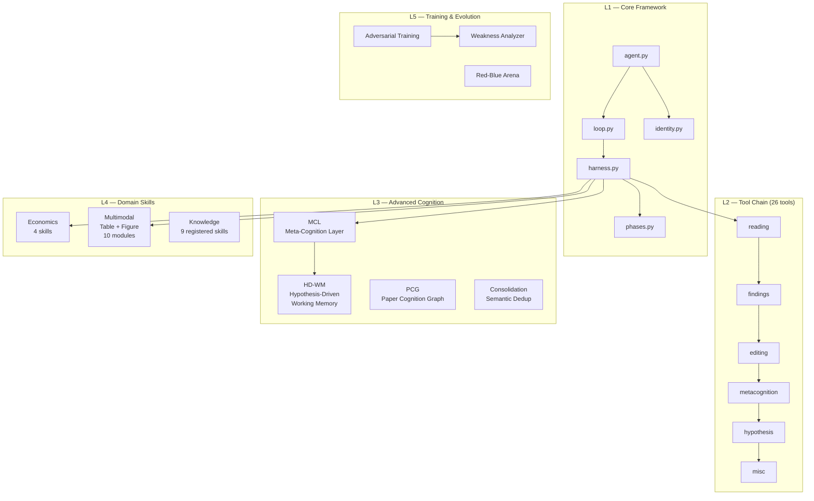

# ScholarAgent — Autonomous Academic Paper Review Agent

<p align="center">
  <strong>A cognitive agent that reads academic papers and produces structured peer-review findings.</strong><br>
  Not a prompt chain. Not a workflow builder. A model with domain-specific tools, doing what agents do:<br>
  <em>perceive → reason → act → reflect → iterate.</em>
</p>

<p align="center">
  <a href="#quick-start">Quick Start</a> •
  <a href="#architecture">Architecture</a> •
  <a href="#performance">Performance</a> •
  <a href="#configuration">Configuration</a> •
  <a href="docs/USER_GUIDE.md">User Guide</a> •
  <a href="LICENSE">GPL-3.0</a>
</p>

---

## What Is This

ScholarAgent is an **LLM-powered academic paper review agent**. You give it a PDF (or Markdown) paper, and it autonomously reads, reasons about methodology, checks data consistency, and produces structured review findings — each with priority, evidence, and section location.

It is designed as a **cognitive system**, not a pipeline. The agent decides what to read next, what hypotheses to form, when to dig deeper, and when to stop. The harness provides tools, memory, and constraints — the model provides judgment.

**Key metrics** (evaluated against human-annotated gold standard):

| Metric | Baseline | Current | Δ |
|--------|----------|---------|---|
| Precision | 58.3% | 89.5% | +31.2pp |
| Recall | 38.9% | 50.0% | +11.1pp |
| **F1** | **46.3%** | **63.2%** | **+16.9pp** |

---

## Quick Start

```bash
# 1. Clone and install
git clone https://github.com/your-username/scholar-agent.git
cd scholar-agent
pip install -r v2/requirements.txt

# 2. Configure API key
cp .env.example .env
# Edit .env: add your OpenAI API key (or any OpenAI-compatible endpoint)

# 3. Run
python v2/main.py path/to/your-paper.pdf
```

That's it. The agent will begin an interactive review session — reading sections, forming hypotheses, and reporting findings. You can ask follow-up questions at any point.

### Docker (Alternative)

```bash
docker-compose up
# Then: docker exec -it scholar-agent python v2/main.py /papers/your-paper.pdf
```

See [Docker Setup](#docker-setup) for details.

---

## Architecture

ScholarAgent uses a **5-layer cognitive architecture**:



### Design Philosophy

The core insight: **agency comes from the model; the harness makes agency real.**

- **Agent = Cognition, not Orchestration.** The model decides what to do. The code executes what the model asks for.
- **Depth emerges autonomously.** No hardcoded "read section 1, then section 2" — the agent navigates based on what it finds.
- **Constrain, don't control.** Phase transitions are nudges, not blocks. The agent can override if it has good reason.
- **LLM = stateless CPU; Harness = registers + memory + bus.** State lives in the harness (findings, hypotheses, paper sections), not in the conversation history.

### Execution Flow

```
main.py → ScholarAgent.start()
    → load_paper() (PDF/MD → sections)
    → pre_generate_cognitive_hints() (LLM strategy planning)
    → cognitive_loop() (autonomous review, 30+ turns)
    → deep_verify() (heuristic skill validation)
    → consolidation_pass() (semantic deduplication)
    → return structured findings
```

---

## Features

### Cognitive Loop with Phase FSM

The agent progresses through phases: `INITIAL_SCAN → DEEP_REVIEW → EDITING → SYNTHESIS`. Transitions are nudge-based — the agent decides when it has enough evidence to move forward.

### 26 Domain-Specific Tools

Reading (section navigation, literature search, reference reading), Findings (structured issue recording with deduplication), Editing (section/paragraph/sentence level), Metacognition (reflection, planning, cognitive hints), Hypothesis (HD-WM: generate → evidence → resolve), and more.

### Multi-Model Routing (MCL)

The Meta-Cognition Layer routes sub-tasks to appropriate model tiers: HIGH (gpt-4.1) for deep reasoning, MEDIUM (gpt-4.1-mini) for structured tasks, LOW for simple extraction. Reduces cost without sacrificing quality on critical paths.

### Table Processing & Numerical Validation

8-rule consistency engine validates regression tables, descriptive statistics, and cross-references text claims against table values. Detects coefficient-SE mismatches, R² bound violations, sample size monotonicity issues, and more.

### Semantic Consolidation

Post-loop LLM pass that merges semantically duplicate findings while preserving distinct issues. Includes a 60% minimum retention guard to prevent over-aggressive merging.

### 29 Kill Switches

Every major subsystem can be independently enabled/disabled via environment variables (`SCHOLAR_GODEL_*`). Enables controlled experiments and graceful degradation.

### Three Personas

`scholar` (default reviewer), `writer` (revision mode), `code_reviewer` (code analysis). Same cognitive loop, different identity and tool permissions.

### Budget Control & Checkpoint Resume

Token budget acts as a safety net (agent is unaware of it). When exceeded, state is checkpointed and can be resumed with additional budget.

---

## Performance

Evaluated on 2 economics papers with human-annotated gold standard (13 + 9 findings):

| Paper | Agent Findings | Precision | Recall | F1 |
|-------|---------------|-----------|--------|------|
| Paper 001 (DID methodology) | 5 | 80.0% | 30.8% | 44.4% |
| Paper 003 (Innovation policy) | 7 | 100.0% | 77.8% | 87.5% |
| **Combined** | **12** | **91.7%** | **50.0%** | **63.2%** |

Key characteristics:
- **High precision**: 91.7% of reported findings are genuine issues (vs 58.3% baseline)
- **Complementary across runs**: Different runs discover different findings; multi-run union improves recall
- **Stable on well-structured papers**: Paper 003 achieves 87.5% F1 consistently

---

## Configuration

### Environment Variables (.env)

```bash
# Required
OPENAI_API_KEY=your-api-key-here

# Optional: endpoint (default: https://api.openai.com/v1)
OPENAI_BASE_URL=https://api.openai.com/v1

# Optional: models (default: gpt-4.1-mini)
LLM_MODEL=gpt-4.1           # Primary model
LLM_MODEL_HIGH=gpt-4.1      # Deep reasoning tasks
LLM_MODEL_MEDIUM=gpt-4.1-mini  # Structured tasks (consolidation, routing)
LLM_MODEL_LOW=gpt-4.1-mini     # Simple extraction
```

Compatible with any OpenAI-compatible API (Together, Groq, Ollama, vLLM, etc.).

### CLI Options

```bash
python v2/main.py <paper> [options]

Options:
  --mode {interactive,full}   Run mode (default: interactive)
  --persona {scholar,writer,code_reviewer}  Cognitive identity (default: scholar)
  --hdwm                      Enable Hypothesis-Driven Working Memory
  --max-turns N               Maximum loop turns (default: 30)
  --budget N                  Token budget (default: 100000)
  --model MODEL               Override LLM model
  --references FILE [FILE...] Reference papers for comparison
  --quiet                     Reduce output verbosity
  --stream                    Enable streaming output
```

### Kill Switches

All features default ON (except Streaming and V2Contrast). Disable any with:

```bash
export SCHOLAR_GODEL_TABLE_PROCESSING=0   # Disable table validation
export SCHOLAR_GODEL_DUAL_LOOP=0          # Disable dual-loop orchestration
export SCHOLAR_GODEL_ADVERSARIAL_TRAINING=0  # Disable adversarial training
```

Full list: see [`v2/core/godel_config.py`](v2/core/godel_config.py).

---

## Project Structure

```
scholar-agent/
├── v2/                         # Active codebase (self-contained)
│   ├── main.py                 # CLI entry point
│   ├── core/                   # Core engine (49 modules)
│   │   ├── agent.py            # ScholarAgent class
│   │   ├── loop.py             # Cognitive loop driver
│   │   ├── harness.py          # State + tool execution
│   │   ├── consolidation.py    # Semantic finding deduplication
│   │   ├── phases.py           # Phase FSM (nudge-based)
│   │   ├── identity.py         # Persona + tool schemas
│   │   ├── godel_config.py     # 29 kill switches
│   │   ├── skills/             # SkillX programmatic skills
│   │   │   ├── economics/      # 4 economics-specific skills
│   │   │   └── multimodal/     # 10 table/figure modules
│   │   └── tool_handlers/      # 6 handler modules (26 tools)
│   ├── llm/                    # LLM client + model routing
│   ├── evaluation/             # Gold standard evaluation system
│   │   ├── gold_standard/      # Human-annotated findings
│   │   ├── test_papers/        # 5 test papers (PDF)
│   │   └── reports/            # Evaluation results
│   ├── training/               # Adversarial training subsystem
│   ├── skills/                 # Knowledge skills (markdown)
│   └── config/                 # YAML/JSON configuration
├── docs/                       # Design documents
│   ├── COGNITIVE_ANCHOR.md     # First-principles constraints
│   ├── HANDOVER_PROMPT.md      # Session handover context
│   └── USER_GUIDE.md           # User documentation
├── .env.example                # Environment template
├── Dockerfile                  # Container build
├── docker-compose.yml          # One-command deployment
└── .github/workflows/ci.yml    # CI pipeline
```

Legacy directories (`v1/`, `legacy/`, `poc/`) are preserved for reference but not used by v2.

---

## Docker Setup

```bash
# Build and run
docker-compose up -d

# Review a paper
docker exec -it scholar-agent python v2/main.py /papers/your-paper.pdf

# Or mount your papers directory
docker run -v $(pwd)/my-papers:/papers scholar-agent python v2/main.py /papers/paper.pdf
```

The Docker image includes all dependencies and uses the `.env` file for API configuration.

---

## Development

### Prerequisites

- Python ≥ 3.10
- Dependencies: `openai`, `pymupdf`, `python-dotenv` (that's it — intentionally minimal)

### Running Tests

```bash
cd v2/
pip install pytest pytest-asyncio
pytest tests/ -m "not e2e" --tb=short
```

### Running Evaluation

```bash
cd v2/
python -m evaluation.run_recall_verification --paper paper_001 --model gpt-4.1
```

### Code Style

- Type hints everywhere
- Async/await for all LLM calls
- Docstrings on public interfaces
- No registry patterns (except skill_registry for static knowledge)

---

## Design Decisions

| Decision | Rationale |
|----------|-----------|
| Single agent, not multi-agent | Review is one cognitive task deepened, not multiple roles collaborating |
| Phase nudges, not blocks | Agent autonomy > rigid workflow |
| Budget as safety net (invisible to agent) | Agent should think freely; budget prevents runaway cost |
| Term-overlap + LLM consolidation (layered dedup) | Cheap filter catches obvious duplicates; LLM catches semantic ones |
| Kill switches on everything | Enables A/B experiments and graceful degradation |
| No LangChain/CrewAI/AutoGen | Cognitive depth requires custom architecture, not workflow frameworks |

---

## Roadmap

- [x] **Stage 1**: Core review + recall improvement (F1: 46.3% → 63.2%)
- [ ] **Stage 2**: Self-evolution (skill-craft scoring, WAL protocol, Skill-Evolver)
- [ ] **Stage 3**: Engineering polish (this README, Docker, CI, user docs)
- [ ] Future: Web UI, multi-paper comparison, citation verification

---

## License

GPL-3.0 — You may freely use, modify, and distribute this software, but derivative works must be open-sourced under the same license. See [LICENSE](./LICENSE).

---

## Acknowledgments

Built on the Harness pattern from Claude Code architecture. Uses the Friday One-API (Meituan internal) and OpenAI-compatible endpoints.

> "I didn't make the model smarter. I made the harness know when to perceive, when to reason, and when to stop."
